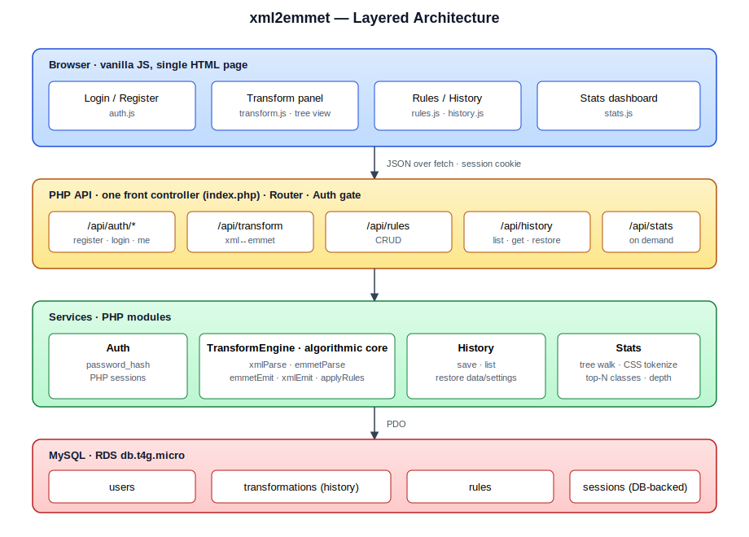
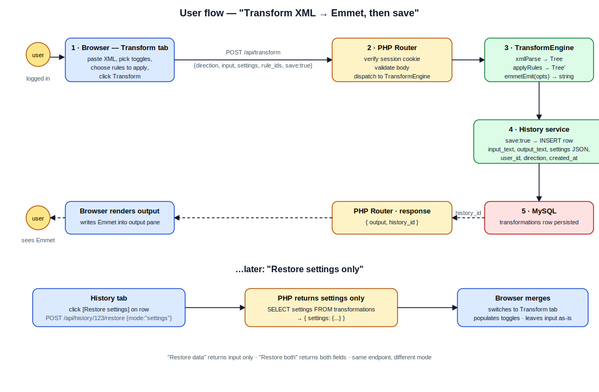

# xml2emmet — Design Overview

A user-facing design document for **xml2emmet**, a web app that converts between XML/HTML markup and Emmet abbreviations in both directions, with persistent history, user-defined rewrite rules, and document statistics.

This document is a *what-it-feels-like* overview of the system from the user's perspective: who they are, what they see, what they do, and what happens. Companion docs:

- [`emmet-grammar.md`](./emmet-grammar.md) — formal grammar of the Emmet syntax we accept.
- [`algorithms.md`](./algorithms.md) — click-op protocol and rule-matching algorithm.
- [`test-cases.md`](./test-cases.md) — acceptance test catalog.

---

## 1. Who is this for?

The primary user is a **web developer or markup author** who already understands HTML/CSS and Emmet shorthand at a basic level. They have markup they want to compress into Emmet (to reuse, share, or learn from) or Emmet they want to expand into real markup. They want to keep a record of past transformations and replay them with different settings.

The lecturer is the secondary user — they will register, run a few transformations, inspect history, define a custom rewrite rule, and look at statistics on a sample HTML document.

What we explicitly do **not** target:
- Mobile-first usage. The app is desktop-first; markup editing on a phone is awkward by nature.
- Real-time collaboration.
- Fully-featured Emmet expansion (e.g. CSS abbreviations, HTML5 boilerplate snippets). We support the structural grammar (`>` `+` `*` `()` `^` `.class` `#id` `[attr]` `{text}`) — that is what the assignment requires.

---

## 2. What does the user see?

The whole app lives on **one HTML page**. After login the user sees a top bar and four tabs:

```
┌─ topbar ─────────────────────────────────────────────────────────┐
│  xml2emmet                          Hi, alice ▾   [logout]       │
├─ tabs ───────────────────────────────────────────────────────────┤
│  [ Transform ] [ Rules ] [ History ] [ Stats ]                   │
└──────────────────────────────────────────────────────────────────┘
```

Before login, only a centered Login / Register card is shown. The four tabs are gated behind authentication — they don't even render.

---

## 3. Architecture at a glance

The app is split into four layers: a thin browser client, a PHP API, a set of PHP service modules (the algorithmic core lives here), and a MySQL database. The browser only renders and forwards user actions; all parsing, emitting, and rule application happens on the server.



Why this split: the lecturer is grading the algorithmic work, and that work belongs in one well-tested PHP module that can be reasoned about in isolation. The browser stays simple and the database stays small.

---

## 4. The user journeys

This is the heart of the document. Each journey describes what the user does, what they see, and what the system does in response.

### 4.1 First visit — registration and login

The user opens the app URL. They see a card with a **Sign in** form and a **Register** link.

If they're new, they click **Register**:

1. They enter a **username** (3–64 chars, must be unique) and a **password** (≥ 8 chars).
2. They click **Create account**.
3. The browser POSTs to `/api/auth/register`. PHP hashes the password with `password_hash()`, inserts a row into `users`, and starts a session.
4. The page swaps to the logged-in shell. The Transform tab is selected by default. No email confirmation, no captcha — this is a uni project.

If the username is taken or the password is too short, the form shows a red inline error under the offending field. No page reload.

Returning users go through the **Sign in** path, which uses `/api/auth/login` and `password_verify()`. Wrong credentials show a single message: *"Username or password is incorrect."* — deliberately vague so we don't leak which one is wrong.

The session cookie is `HttpOnly`, `SameSite=Strict`. It survives a tab refresh; it does not survive logout or session expiry. There is a **Logout** button in the top bar that calls `/api/auth/logout`.

---

### 4.2 The main event — Transform

This is where the user spends most of their time. The Transform tab looks like this:

```
direction:   (•) XML → Emmet     ( ) Emmet → XML
mode:        [✓] HTML mode           (off = generic XML)
detail:      [✓] text content
             [✓] attribute names
             [✓] attribute values
rules:       [ select rules to apply ▾ ]   (optional)

┌─ Input ─────────────────────────────┐ ┌─ Output ────────────────────────────┐
│                                     │ │                                     │
│  <ul>                               │ │  ul>li.item{one}+li.item{two}       │
│    <li class="item">one</li>        │ │                                     │
│    <li class="item">two</li>        │ │                                     │
│  </ul>                              │ │                                     │
│                                     │ │                                     │
└─────────────────────────────────────┘ └─────────────────────────────────────┘

[ Transform ]  [ Save to history ]   ← live tree view appears below after Transform
```

**The core action:**

1. The user pastes XML (or HTML) into the **Input** pane on the left.
2. They pick a **direction**. The default is XML→Emmet.
3. They tick **HTML mode** if their input is HTML (lenient parsing, Emmet shorthand `.class`/`#id`/`{text}` in the output). They leave it off for generic XML (strict parsing, every attribute as `[name=value]`).
4. They tick which **detail** they want in the output:
   - **text content** — element text is included.
   - **attribute names** — attributes are emitted at all.
   - **attribute values** — values are included (only meaningful with attribute names).
   These three are independent. If they untick all three they get pure structure: just tags and operators.
5. Optionally, they expand the **rules** dropdown and pick one or more saved rewrite rules to apply (e.g. "swap siblings", "div→section"). If they don't, no rules are applied.
6. They click **Transform**.

**What happens:** the browser POSTs `/api/transform` with the input, direction, settings, and rule IDs. The PHP `TransformEngine` parses the input into a canonical Tree, applies rules in order, then runs the appropriate emitter. The result comes back as JSON and is written into the **Output** pane.

The user can also click **Save to history** (or a checkbox "save automatically"). When set, the request includes `save:true` and the server inserts a row into `transformations` containing the input, output, settings, and applied rule IDs. The pane briefly flashes *"Saved"*.

**The tree view (interactive editing):**

After a successful transform, a collapsible tree view appears below the panes, showing the parsed input. Each node is a row with a label and three small buttons: ↕ swap with sibling, ⤴ unwrap, ✕ delete. Clicking any of them issues a single **click-op** to the server (`/api/transform` again with `click_ops:[…]`), the tree is re-rendered and the output regenerates. This is the "click-based tree manipulation" the assignment asks for. It does not affect saved history unless the user clicks Save again.

**Errors:** if the input fails to parse (malformed XML, unbalanced Emmet brackets), the Output pane shows a red message with the parser's location info (e.g. *"Parse error at line 3, column 12: expected '>'"*). The user can fix and re-transform.

The flow end-to-end:



---

### 4.3 Editing rewrite rules — the Rules tab

The Rules tab is where the user **defines reusable transformations**. The page shows a list of their saved rules and an inline form to create a new one:

```
Your rules
─────────────────────────────────────────────────────────────
swap siblings           pattern: E1+E2          → E2+E1     [edit] [delete]
div → section           pattern: div>E1         → section>E1[edit] [delete]
─────────────────────────────────────────────────────────────

New rule
  Name:        [ promote h2 to h1                       ]
  Pattern:     [ h2{E1}                                 ]   ✓ valid
  Replacement: [ h1{E1}                                 ]   ✓ valid
  [ Save ]
```

Pattern and replacement are **Emmet snippets** with placeholders `E1`, `E2`, `E3`, … standing in for "any subtree." Both fields validate live: as the user types, the field gets a green check (parses cleanly) or a red underline with a tooltip (parse error). Saving is blocked until both parse.

When the user later applies a rule during a transform, the engine walks the parsed input tree in pre-order, attempts to bind each placeholder against a subtree, and substitutes the replacement on match. Multiple rules apply in the order the user picks them.

A rule is owned by the user who created it. There is no rule sharing in this version.

---

### 4.4 Replaying past work — the History tab

History is **per user**. It shows every transformation the user saved, newest first:

```
Transformation history                                    [ ◀ Prev ]  [ Next ▶ ]
─────────────────────────────────────────────────────────────────────────────────
date          dir        input preview                  actions
─────────────────────────────────────────────────────────────────────────────────
2026-05-25    XML→Emmet  <ul><li class="item">…         [data] [settings] [both]
   14:23
2026-05-25    Emmet→XML  ul>li.item*3                   [data] [settings] [both]
   13:55
2026-05-22    XML→Emmet  <article><h1>Hello…            [data] [settings] [both]
   09:11
─────────────────────────────────────────────────────────────────────────────────
```

Each row has three explicit restore buttons. Their meaning is precise:

- **Restore data** — load only the past *input* into the Transform tab. Current toggles, current selected rules: untouched. Useful when the user wants to retry the same input under different settings.
- **Restore settings** — load only the past *toggles, HTML-mode, and rule selection* into the Transform tab. Current input: untouched. Useful when the user has a new input but wants the same configuration as last time.
- **Restore both** — load both. The Transform tab is reset to exactly the state of that past run, ready to re-execute.

After clicking any of the three, the app switches to the Transform tab automatically. Nothing is transformed yet — the user reviews and clicks Transform.

This is what the assignment means by *"restore by data only / by settings only / by both."* The split is enabled by storing input and settings as separate columns in the `transformations` table.

The history table is paginated (50 per page). Clicking a row anywhere outside the buttons opens a read-only detail view with the full input, full output, and all settings — useful for inspection without restoring.

---

### 4.5 Looking at a document — the Stats tab

Stats is **stateless** — nothing here is saved. The user pastes an HTML or CSS document, picks the kind, clicks Run, and sees a small dashboard:

```
kind:  (•) HTML   ( ) CSS
[ paste document here ]
[ Run ]

┌─ HTML stats ──────────────────────────────────────┐
│ Elements:           284                           │
│ Distinct tags:      28                            │
│ Attributes:         412                           │
│ Max nesting depth:  9                             │
│                                                   │
│ Top 3 classes                                     │
│   .btn          (47)                              │
│   .container    (31)                              │
│   .row          (28)                              │
│                                                   │
│ Top 100 classes  ▶ (expandable)                   │
│                                                   │
│ Depth histogram                                   │
│   1: ▇▇                                           │
│   2: ▇▇▇▇▇▇                                       │
│   3: ▇▇▇▇▇▇▇▇▇▇▇▇                                 │
│   …                                               │
└───────────────────────────────────────────────────┘
```

For HTML the engine reuses the `xmlParse` step (HTML mode) and walks the resulting tree once. For CSS it runs a small tokenizer that just cares about class selectors. Both kinds return JSON; the dashboard renders it.

The user can re-run with different inputs as often as they like; nothing is persisted, no history row is created.

---

### 4.6 Logging out

A button in the top bar. It POSTs `/api/auth/logout`, the session is destroyed, the page returns to the Login / Register card. Any unsaved Transform-tab state is discarded — there is no "draft" recovery.

---

## 5. Settings, defaults, and what's remembered

The app has very little global configuration. The user's choices on the Transform tab (direction, HTML-mode, detail toggles, selected rules) are **session-local** — they persist while the user navigates between tabs in the same browser session, but are not stored to the database between sessions. If the user wants to "remember" a configuration, they save a transform to history and restore its settings later.

There is no theme switcher, no language switcher, no profile page. Stack of features is intentionally narrow.

---

## 6. Errors the user can hit, and what they see

| Situation                                  | What the user sees                                      |
|--------------------------------------------|---------------------------------------------------------|
| Username taken on register                 | inline red text under the field                         |
| Password too short                         | inline red text under the field                         |
| Wrong username or password on login        | *"Username or password is incorrect."*                  |
| Malformed XML / Emmet on Transform         | red message in Output pane with line/column             |
| Rule pattern fails to parse                | red underline + tooltip in the Rules form               |
| Network error talking to the API           | toast: *"Couldn't reach the server. Try again."*        |
| Session expired (cookie missing on a call) | the app redirects to the Login / Register card          |
| Server-side bug (500)                      | toast: *"Something went wrong. Try again."* and a request id |

Errors are small, contextual, and don't blow away the user's input.

---

## 7. Privacy and persistence

- Passwords are hashed with PHP's `password_hash()` (bcrypt by default). Plaintext is never stored.
- A user's **history** and **rules** are visible only to that user. There is no admin role.
- We do not track analytics. We do not send anything to third parties.
- The transformation input is stored verbatim in the database when the user clicks Save. They should not paste secrets into the Transform tab.

---

## 8. Where things run

The app is a single PHP application backed by MySQL. The intended deployment is **AWS Elastic Beanstalk (PHP platform) + RDS MySQL** in the same VPC, with a simpler fallback of a single EC2 LAMP instance. Detailed env vars, session-storage layout, and `.ebextensions` config are not covered in this document — they will be produced as part of the implementation.

For local development the user (i.e. the developer) only needs PHP 8.x and MySQL on their machine. There is no build step, no bundler, no Node toolchain.

---

## 9. What this document does **not** cover

- Specific database column types — see the data model in the implementation plan.
- API request/response schemas in full — see the implementation plan.
- AWS configuration files (`.ebextensions`, IAM roles) — produced during implementation.

For the formal Emmet grammar, the click-op protocol and rule-matching algorithm, and the acceptance test catalog, see [`emmet-grammar.md`](./emmet-grammar.md), [`algorithms.md`](./algorithms.md), and [`test-cases.md`](./test-cases.md).
